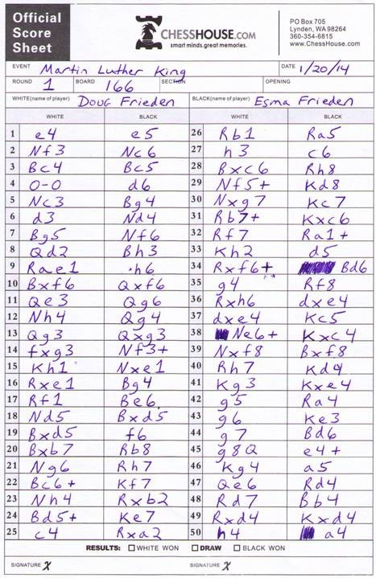

# Blocco note
Il blocco note è l'oggetto usato per trascrivere le mosse dei giocatori in accordo con un particolare formato chiamato [notazione algebrica standard](https://it.wikipedia.org/wiki/Notazione_algebrica).

## Specifica

1. Tranne il pedone, ogni pezzo è rappresentato da una iniziale: R=Re, D=Donna, T=Torre, A=Alfiere, C=Cavallo;
2. Le case si rappresentano indicando prima la colonna e poi la traversa, ad esempio: a1, f5, h8;
3. Per indicare una mossa, va indicata l'iniziale del pezzo (tranne nel caso dei pedoni) e la casa di arrivo. Ad esempio, Ac4 indica un alfiere che muove nella casa c4, mentre e4 indica che un pedone muove in e4;
4. La promozione di un pedone si verifica quando raggiunge l'ultima traversa (la 8 se il pedone è bianco, la 1 se il pedone è nero) e viene indicata apponendo l'iniziale del pezzo scelto dopo la mossa: ad esempio a8D indica che un pedone raggiunge la casa a8 e viene promosso a donna;
5. Quando un pezzo effettua una cattura (cioè quando "mangia" un altro pezzo che si trova nella casa di destinazione), si inserisce una x tra l'iniziale del nome e la casa di destinazione: ad esempio Axe5 indica che un alfiere ha catturato in e5
6. Le mosse vanno presentate in questo modo: `numero del turno`. `mossa bianco` `mossa nero`
7. L'arrocco corto viene indicato con 0-0 e l'arrocco lungo con 0-0-0;
8. Se due pezzi dello stesso tipo possono raggiungere la stessa casa, si inserisce prima della casa di arrivo la traversa o la colonna di partenza del pezzo, in modo da evitare ambiguità: ad esempio, se due cavalli sono in e2 e in g2, e la mossa prevede che uno dei due si sposti in f4, si scriverà Cef4 oppure Cgf4, mentre, se i cavalli sono in a8 e in a6 e uno dei due muove in c7, si scriverà C8c7 oppure C6c7;
8. Se due pezzi dello stesso tipo possono catturare lo stesso pezzo, si inserisce prima della casa di arrivo la traversa o la colonna di partenza del pezzo, ad esempio Cexf3 indica che il cavallo della colonna e cattura in f3. Nel caso dei pedoni si indica la colonna di partenza al posto dell'iniziale del nome del pezzo: dxe5 indica che il pedone della colonna d cattura in e5;
9. In caso di presa en passant si indica la casa di arrivo del pedone che cattura, non quella del pedone catturato; inoltre si può far seguire la dicitura e.p.: quindi cxb6 e.p.
10. Lo scacco viene indicato con un + (ad esempio Axf7+)
11. Lo scacco matto con # (ad esempio Axf7#)
12. La notazione 1-0 si usa a fine partita per indicare la vittoria del bianco, 0-1 per indicare la vittoria del nero, ½-½ o 0,5-0,5 o anche ,5-,5 per indicare una patta. Le parole "Il bianco abbandona" o "Il nero abbandona" possono essere usate in caso di abbandono.

