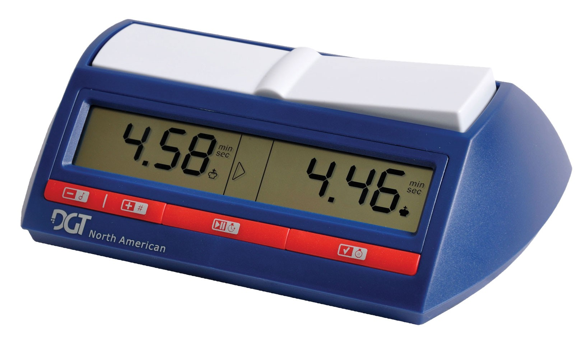

# Orologio
L'orologio serve a conteggiare il tempo residuo concesso ai due giocatori, nel nostro caso 5 minuti.

## Specifica
1. Quando l'utente accende l'orologio, entrambi i tempi residui devono essere impostati su 5 minuti;
2. Quando avvia l'orologio, il tempo inizierà a decrescere per il Giocatore1;
3. Quando mette in pausa l'orologio, il tempo non deve decrescere;
4. Quando avvia l'orologio mentre era in pausa, il tempo deve ricominciare a decrescere per il giocatore che era di turno;
5. Quando si cambia giocatore, il tempo deve arrestarsi per il giocatore precedente ed iniziare a decrescere per il giocatore attualmente di turno;
6. Quando resetta l'orologio, il tempo deve essere reimpostato a 5 minuti per entrambi i giocatori. Il tempo residuo resterà fermo per entrambi i giocatori finché l'utente non lo avvia;
7. *Nice-to-have*: Se si prova ad avviare l'orologio senza averlo prima acceso, deve essere sollevata un'eccezione (es.  `throw new InvalidOperationException("Prima devi accenderlo");`). L'eccezione impedirà la normale esecuzione del programma e questo sarà utile ad informare altri sviluppatori che usano la vostra classe `Orologio` sul corretto uso della classe. Possiamo intenderla come un'estrema forma di documentazione;
8. *Nice-to-have*: Sollevare l'evento `TempoScaduto` quando il tempo residuo del giocatore di turno arriva a zero.

## Esempio di orologio per scacchi da tenere alla mano durante la modellazione
Questo particolare orologio ha:
* Due tasti per cambiare il tono o il volume dell'allarme (che è irrilevante per noi e che perciò non modelleremo);
* Un unico tasto per avviare e mettere in pausa;
* Un tasto per resettare il timer;
* Un tasto posteriore (qui non visibile) per accedere l'orologio. L'orologio si spegne automaticamente dopo alcuni minuti di inattività;
* Un tastone basculante superiore che serve a passare il turno all'altro giocatore. In questa immagine, è di turno il giocatore che ha i pezzi neri (perciò sta decrescendo il suo tempo residuo).
