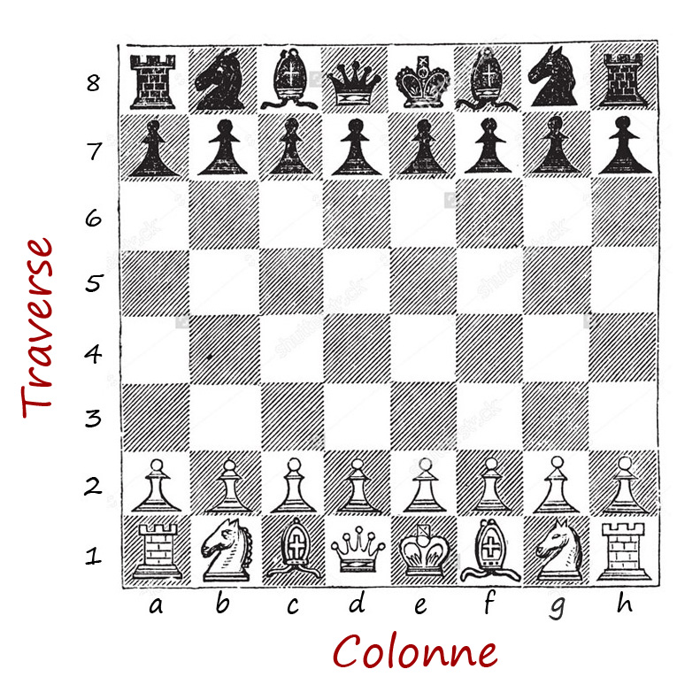

# Pezzi
Ogni set di pezzi, bianco o nero, è composto di pedoni, torri, alfieri, cavalli, donna e re.

## Specifica
0. La mossa è valida se il giocatore sposta il pezzo di almeno una casa, in una qualsiasi direzione;
1. Il Pedone può avanzare verticalmente di una casa. Il pedone bianco inizia dalla seconda traversa e può avanzare fino all'ottava. Viceversa, il pedone nero inizia dalla settima traversa e può avanzare fino alla prima;
2. Se il Pedone si trova nella sua traversa di inizio (la seconda se il pedone è bianco o la settima se il pedone è nero) può avanzare due case;
3. La Torre può spostarsi lungo una linea verticale o orizzontale di quante case desidera;
4. L'Alfiere può spostarsi lungo una linea diagonale di quante case desidera;
5. La Donna può spostarsi lungo una linea verticare, orizzontale o diagonale di quante case desidera;
6. Il Cavallo può spostarsi con un movimento ad "L", ovvero una casa orizzontalmente e due verticalmente; oppure, due orizzontalmente e una verticalmente;
7. Il Re può spostarsi orizzontalmente, verticalmente o diagonalmente di una sola casa;
8. Il Pedone può avanzare diagonalmente di una casa per catturare un pezzo dell'altro colore;

9. Il Pedone non può assolutamente muoversi in avanti se c'è un qualsiasi altro pezzo che gli blocca la strada;

10. La Torre non può scavalcare gli altri pezzi nel suo movimento orizzontale o verticale. Questo significa che è costretta a muoversi solo fino alla casa precedente a quella in cui si trova un pezzo dello stesso colore, oppure occupa la stessa casa in cui si trova un pezzo dell'altro colore, catturandolo;

   

11. L'alfiere non può scavalcare gli altri pezzi nel suo movimento diagonale. Questo significa che è costretto a muoversi solo fino alla casa precedente a quella in cui si trova un pezzo dello stesso colore, oppure occupa la stessa casa in cui si trova un pezzo dell'altro colore, catturandolo;

   

12. La Donna non può scavalcare gli altri pezzi nel suo movimento orizzontale, verticale o diagonale. Questo significa che è costretta a muoversi solo fino alla casa precedente a quella in cui si trova un pezzo dello stesso colore, oppure occupa la casa in cui si trova un pezzo dell'altro colore, catturandolo.

   

13. Il cavallo può scavalcare i pezzi nel suo movimento ad L ma non può muoversi in case in cui si trova un pezzo dello stesso colore. Se invece nella casa in cui va a muoversi c'è un pezzo di colore diverso, lo cattura.

 

14. Il Re non può muoversi in caselle in cui è presente un pezzo dello stesso colore.

