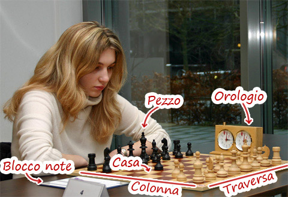

# Tavolo
Il tavolo è l'oggetto che regge tutti gli altri componenti del gioco ed è il posto in cui si svolge la partita.

## Specifica

1. Prima che la partita inizi, il tavolo deve chiedere il nome del giocatore bianco e del giocatore nero;
1.5. All'inizio della partita, deve essere predisposta la scacchiera e l'orologio dovrà essere avviato;
2. Il tavolo deve accettare come input la mossa del giocatore corrente; Il formato atteso è il seguente: B2 B3, dove B2 è la casa di partenza e B3 quella di arrivo.
3. La mossa può essere accettata solo se il giocatore corrente ha abbastanza tempo residuo. Se il tempo è scaduto, proclamare la vittoria dell'altro giocatore;
4. La mossa può essere accettata solo se la casa di partenza contiene un pezzo del colore del giocatore corrente, altrimenti deve essere stampato l'errore "Mossa non valida" e accettare un nuovo input dal giocatore;
5. La mossa può essere accettata solo se il pezzo della casa di partenza può effettivamente muovere alla destinazione indicata. In caso di errore, stampare "Mossa non valida", altrimenti spostare il pezzo nella sua destinazione;
6. Se nella scacchiera manca un Re, va proclamata la vittoria del giocatore che possiede ancora il Re;
7. Dopo ogni mossa (consentita o no) deve essere visualizzata la scacchiera e il suo stato attuale. Deve essere chiesto all'altro giocatore di inserire la sua mossa (si torna al punto 1).

